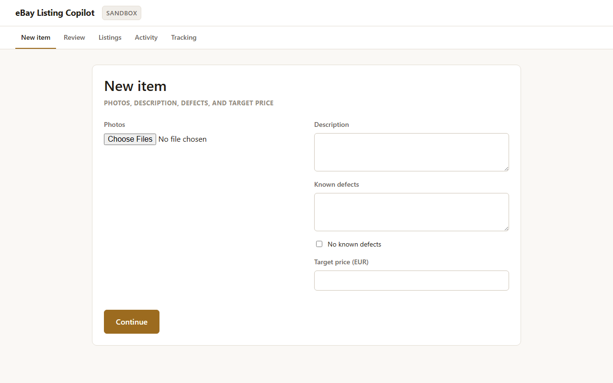
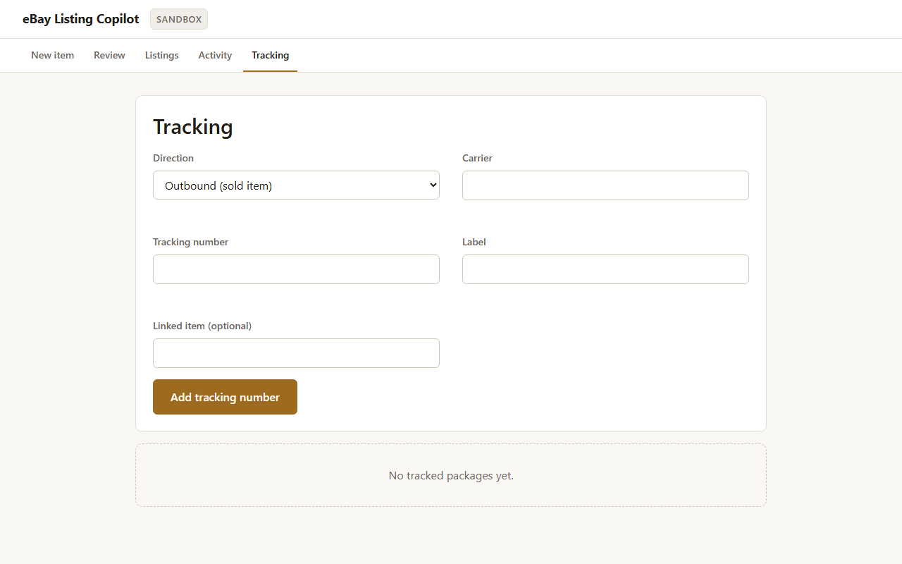

# eBay Listing Copilot

eBay Listing Copilot is a local, approval-driven web application for creating and managing a seller's own eBay listings with minimal input.

The seller supplies item photos, a short description, known defects, and a target price. The application researches the item and comparable listings, prepares the required listing information, researches domestic and continental-European shipping, and creates an unpublished eBay draft. It presents a concise evidence-backed summary and publishes only after the seller explicitly approves that exact draft.

  
  

## Intended workflow

1. Add item photos, a short description, known defects, and a target price.
2. Confirm package weight, dimensions, and the saved ship-from location.
3. Let the application research the item, comparable listings, and shipping options.
4. Review the proposed title, category, condition, item specifics, description, price, policies, and shipping.
5. Approve, reject, or request changes.
6. Publish the approved draft and receive the live eBay URL and listing ID.
7. On later app launches or listing changes, review one-time alerts for new offers, completed sales, and refunds.
8. Enter the carrier and tracking number for any package — items shipped to buyers, or personal inbound packages the seller is receiving — and see delivery status refreshed automatically on every login.

## Core principles

- **Human approval before publication:** no listing is published, materially revised, relisted, or ended without explicit approval.
- **Evidence over invention:** researched claims retain their sources; uncertain values are clearly marked and must not be presented as facts.
- **Honest condition reporting:** known defects are preserved throughout the workflow and cannot be silently removed.
- **Private by default:** credentials, seller data, item photos, and real listings remain on the seller's computer.
- **Public-repository safe:** the repository contains only source code, fictional examples, safe configuration templates, and documentation.
- **Provider-neutral integrations:** eBay, AI-assisted research, and shipping quotes sit behind replaceable adapters.
- **Actionable, deduplicated notifications:** the app checks once at startup and after listing changes, then alerts only on newly observed offers, sales, or refunds.
- **Tests enforced in GitHub:** the repository's pipeline runs formatting, linting, type checking, offline tests, and security checks before changes are accepted.

## Shipping scope

The first version covers:

- Domestic shipping within Italy
- EU destinations in continental Europe
- Non-EU continental-European destinations, handled separately for customs and pricing

Because eBay.it does not provide the same native calculated-shipping support available in certain other marketplaces, the application obtains or researches quotes externally and converts the approved result into eBay-compatible flat shipping costs, fulfillment policies, or shipping-rate tables.

## Initial scope

The initial release focuses on listing creation, approval, publication, deliberate listing revisions, read-only notifications for offers, sales, and refunds, and manual tracking-number entry with a login-triggered delivery-status refresh. Order fulfillment, shipment label purchase, automatic tracking upload to eBay/buyers, customer messaging, returns processing, accounting, autonomous repricing, automatic offer responses, and automatic refunds are outside the first release.

## Documentation

- [Setup](docs/setup.md) — requirements, configuration, running locally and running the tests.
- [Architecture](docs/architecture.md) — codebase map and key workflows.
- [Privacy and safety model](docs/privacy.md) — approval hashing, idempotent publish, notification/tracking scope, data retention and deletion.
- [Security policy](SECURITY.md) — supported versions and how to report a vulnerability privately.
- [Contributing](CONTRIBUTING.md) — workflow and required checks for changes.
- [Deploying to Hetzner](docs/deploy.md) — Docker/Caddy deployment sharing a server with another app.

The validated design is documented in [`docs/superpowers/specs/2026-07-17-ebay-listing-copilot-design.md`](docs/superpowers/specs/2026-07-17-ebay-listing-copilot-design.md).

Mandatory credential-handling, security, coding, testing, and public-release rules are defined in [`AGENTS.md`](AGENTS.md).

The approved task-by-task execution plan is in [`docs/superpowers/plans/2026-07-17-ebay-listing-copilot-implementation.md`](docs/superpowers/plans/2026-07-17-ebay-listing-copilot-implementation.md).

## License

MIT — see [`LICENSE`](LICENSE).
